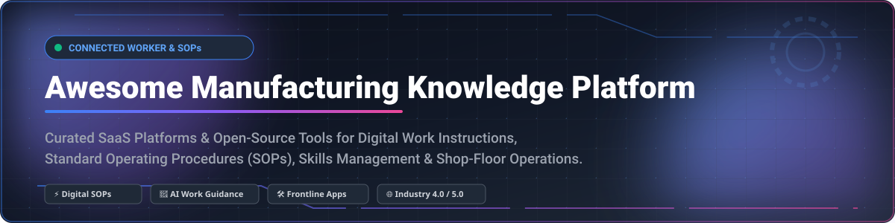

  
  
  
  
  
  
  
  

# 🏭 Awesome Manufacturing Knowledge Platform

> **A Curated List of SaaS Products & Open-Source Projects for Digital Work Instructions, Connected Workers, Standard Operating Procedures (SOPs), Skills Management & Frontline Operations Guidance.**

*Last updated: September 2026*

---

This repository tracks notable **SaaS platforms** and **open-source projects** designed for **Manufacturing Knowledge Platforms** (connected worker / digital work instruction ecosystems). These industrial software solutions capture expert tribal knowledge, deliver interactive step-by-step visual guidance directly on the shop floor, manage frontline skills and certifications, and empower manufacturing teams to standardize work across shifts and production facilities.

---

## 📌 Table of Contents

- [📊 Market Overview](#-market-overview)
- [🏢 SaaS & Hosted Platforms](#-saas--hosted-platforms)
- [🔓 Open-Source Repositories & Tools](#-open-source-repositories--tools)
- [💡 Key Implementation Patterns](#-key-implementation-patterns)
- [🤝 How to Contribute](#-how-to-contribute)
- [💖 Support & Sponsorship](#-support--sponsorship)
- [📈 Star History](#-star-history)
- [⚠️ Disclaimer](#%EF%B8%8F-disclaimer)

---

## 📊 Market Overview

> 📊 **Market Insights:** The global **Connected Worker & Digital Work Instructions Market** is estimated at **$5.2 Billion in 2026** and is projected to expand to **$18.5 Billion by 2032** at a Compound Annual Growth Rate (CAGR) of **23.5%**. The sector is currently **moderately fragmented**, comprising rapid-growth venture-backed scaleups (e.g., Tulip, Augmentir), strategic acquisitions by enterprise ERP/EAM providers (e.g., Poka acquired by IFS, SwipeGuide acquired by L2L), and specialized niche tools, rather than a single winner-take-all monopoly.

---

## 🏢 SaaS & Hosted Platforms

Below is a structured overview of leading enterprise commercial platforms, sorted by **Company Size / Market Valuation** in descending order.

| 🏢 Product | 📝 Description | 💰 Specific Pricing | 🆓 Free Tier / Trial Limits | 📊 Company Size (Valuation / Revenue) |
| :--- | :--- | :--- | :--- | :--- |
| **[Tulip Interfaces](https://tulip.co/)** | No-code frontline operations platform enabling manufacturing teams to build visual work instructions, app-driven quality checks, and machine telemetry dashboards. | Starts at **$100/month** per active interface seat (Basic plan); Professional tier at **$300/month**. | **No free-forever plan; 30-day guided trial available upon demo request.** | **$1.3B Valuation** (~$85M ARR) |
| **[Poka](https://www.poka.io/)** *(IFS)* | Connected worker platform combining visual digital work instructions, skills matrices, issue tracking, and frontline worker communication. | Starts at **$15/user/month** (minimum 50 user seats / ~$750/month base subscription). | **No free-forever plan; 14-day interactive sandbox trial available via sales demo.** | **~$200M Valuation** (Acquisition; ~$18.6M ARR) |
| **[Operations1](https://operations1.com/)** | Connected worker and adaptive digital process platform for structured shop-floor execution, audit management, and quality control. | Starts at **€250/month** (approx. $275/mo) for base digital procedure authoring module. | **No free-forever plan; 14-day full-feature trial on request.** | **~$80M Valuation** (~$15M ARR; Raised $16.3M) |
| **[Dozuki](https://www.dozuki.com/)** | AI-assisted connected worker platform built for authoring standard work, managing document approval workflows, and digitizing frontline training. | Starts at **$850/month** (includes up to 50 user seats, $10/mo per extra user). | **No free-forever plan; 14-day trial available via sales onboarding.** | **~$75M Valuation** (~$15M ARR; Marlin Equity) |
| **[Augmentir](https://www.augmentir.com/)** | AI-powered connected worker platform delivering personalized augmented work instructions, operational analytics, and remote expert support. | Starts at **$20/user/month** (minimum 25 users / ~$500/month platform fee). | **No free-forever plan; 14-day free trial available upon request.** | **~$60M Valuation** (~$3.8M ARR; Raised $16.9M) |
| **[Azumuta](https://www.azumuta.com/)** | Integrated connected worker platform providing visual work instructions, real-time quality audits, and operator skills matrix management. | Starts at **€15/user/month** (approx. $16.50/mo, min. €250/month base). | **No free-forever plan; 14-day free trial with full feature access.** | **~$30M Valuation** (~$3.0M ARR; Series A 2025) |
| **[SwipeGuide](https://www.swipeguide.com/)** *(L2L)* | Mobile-first visual work instructions platform emphasizing rapid visual guide creation, standard work execution, and shop-floor feedback loops. | Pro Plan starts at **$649/month** (includes 50 creators & operators). | **No free-forever plan; 14-day free trial (up to 5 guides & 10 users).** | **~$25M Valuation** (~$2.8M ARR; Acquired by L2L) |
| **[REWO](https://www.rewo.io/)** | Visual knowledge capture & digital work instruction software specializing in video-based SOP authoring and operator guidance. | Starts at **$149/month** (includes 10 creators/operators and 20 video SOPs). | **No free-forever plan; 14-day free trial with full video authoring.** | **~$15M Valuation** (~$2.0M ARR) |
| **[KnowledgeVine](https://www.knowledgevine.com/)** | Frontline manufacturing knowledge management system designed for capturing, standardizing, and delivering shop-floor procedures. | Starts at **$350/month** (includes safety & operational procedures module). | **No free-forever plan; 14-day trial environment provided upon request.** | **~$10M Valuation** (~$1.5M ARR) |
| **[Intoware WorkfloPlus](https://www.intoware.com/)** | Digital workflow and work instruction solution converting paper SOPs into step-by-step guided procedures for mobile & wearable devices. | Starts at **£25/user/month** (approx. $32/user/month, min. 10 users). | **No free-forever plan; 14-day full feature trial on mobile/wearables.** | **~$8M Valuation** (~$1.2M ARR) |

---

## 🔓 Open-Source Repositories & Tools

Full-featured enterprise connected worker platforms are primarily commercial. However, manufacturers can assemble flexible, cost-effective open-source platforms using **no-code app builders, document control wikis, open ERP modules, digital form engines, and workflow automation platforms**.

The projects below are sorted by **GitHub Stars** in descending order:

1. ⚡ **[n8n](https://github.com/n8n-io/n8n/stargazers)**   
   *Fair-code workflow automation platform connecting shop-floor IoT events, SOP execution triggers, and frontline alert notifications.*

2. 📊 **[NocoDB](https://github.com/nocodb/nocodb/stargazers)**   
   *Open-source NoCode platform turning databases into smart spreadsheets for tracking manufacturing equipment assets, operator skills matrices, and work order logs.*

3. 🏭 **[Odoo](https://github.com/odoo/odoo/stargazers)**   
   *Comprehensive suite of open-source business apps featuring Work Center Work Instructions, Manufacturing Execution (MRP), and Quality Control modules.*

4. 🛠️ **[ToolJet](https://github.com/tooljet/tooljet/stargazers)**   
   *Open-source low-code framework to quickly build custom shop-floor operator portals, digital execution checklists, and SOP viewing tools.*

5. 📱 **[Appsmith](https://github.com/appsmithorg/appsmith/stargazers)**   
   *Open-source low-code application platform for constructing custom frontline work instruction dashboards, procedure authoring interfaces, and operator forms.*

6. 📝 **[Outline](https://github.com/outline/outline/stargazers)**   
   *Fast, modern collaborative team wiki & knowledge base for standard operating procedures (SOPs), safety guidelines, and manufacturing process manuals.*

7. ⚙️ **[ERPNext](https://github.com/frappe/erpnext/stargazers)**   
   *Open-source ERP featuring comprehensive manufacturing work order routing, shop-floor workstation guidance, maintenance schedules, and quality inspections.*

8. 🗄️ **[Directus](https://github.com/directus/directus/stargazers)**   
   *Open data platform & Headless CMS for managing and serving digital work instruction content, equipment asset logs, and photo/video procedure media.*

9. 📚 **[Wiki.js](https://github.com/requarks/wiki/stargazers)**   
   *Powerful and modern open-source wiki software suitable for organizing shop-floor standard operating procedures, ISO compliance documents, and training manuals.*

10. 🧱 **[Budibase](https://github.com/budibase/budibase/stargazers)**   
    *Open-source low-code platform for building custom shop-floor internal applications, digital inspection forms, and step-by-step guidance interfaces.*

11. 📖 **[BookStack](https://github.com/BookStackApp/BookStack/stargazers)**   
    *Simple, self-hosted documentation system structured into Books, Chapters, and Pages for organizing factory SOPs, safety guides, and operational manuals.*

12. 📋 **[Formbricks](https://github.com/formbricks/formbricks/stargazers)**   
    *Open-source survey & form platform used for shop-floor operator feedback, defect reporting, and digital quality checklists.*

13. 📄 **[Form.io](https://github.com/formio/formio.js/stargazers)**   
    *Open-source combined form builder and rendering engine for building offline-capable digital work instructions, data collection forms, and shop-floor checklists.*

---

## 💡 Key Implementation Patterns

Manufacturers implementing custom or hybrid knowledge architectures often follow this pragmatic stack:

1. **Content Authoring & Document Control**: Write standard procedures in an open wiki (**Outline**, **BookStack**, or **Wiki.js**) with version control and approval workflows.
2. **Asset-Linked Delivery**: Generate equipment QR codes that dynamically link operators directly to specific work instructions on mobile tablets or industrial wearables.
3. **Data & Execution Capture**: Capture shop-floor execution, inspection records, and defect logs using low-code form engines (**Appsmith**, **Budibase**, or **Form.io**).
4. **ERP & Work Center Sync**: Wire production orders and workstation routing directly to ERP platforms (**Odoo** or **ERPNext**).
5. **Continuous Feedback**: Enable operators to submit visual improvement suggestions, updating standard work in closed-loop reviews.

---

## 🤝 How to Contribute

Contributions are highly welcome! To add a new platform or update existing metrics:

1. Fork the repository.
2. Update `README.md` following the table or list format.
3. Ensure description remains factual and includes accurate pricing, trial details, or star counts.
4. Submit a Pull Request with a clear summary.

See our [Awesome List Guidelines](https://github.com/ishandutta2007/Awesome-Awesome-Awesome) for more details.

---

## 💖 Support & Sponsorship

Thank you for exploring the **Awesome Manufacturing Knowledge Platform** ecosystem! If you find this curated list valuable for your manufacturing digital transformation, continuous improvement, or shop-floor operations projects, please consider supporting the project:

- ⭐ **Star this repository** to help others discover it on GitHub.
- 🔀 **Fork & Share** it with your manufacturing engineering, operations, and IT teams.
- 📢 **Contribute** new SaaS products or open-source tools via Pull Requests.
- ☕ **Buy me a coffee / Sponsor**: Support ongoing maintenance and curation on the [GitHub Sponsor Dashboard](https://github.com/sponsors/ishandutta2007).

---

## 📈 Star History

---

## ⚠️ Disclaimer

- This is a **community-curated list** — provided for informational purposes only, not an official endorsement.
- Work instructions directly impact manufacturing quality, operational safety, and regulatory compliance. Open-source or custom-built systems require proper document control, validation (e.g., ISO / FDA compliance), and change management.

---

  <b>Made for manufacturing engineers, continuous improvement leaders, and frontline operations teams.</b> 
  <i>Let's keep shop-floor knowledge accessible, standardized, and continuous.</i>

